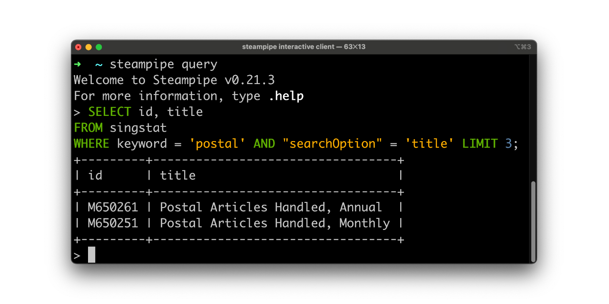

# SingStat Plugin for Steampipe

Use SQL to query data from [Singapore Department of Statistics](https://singstat.gov.sg).



> Note: This project is not officially endorsed or sanctioned by the Government of Singapore, Department of
> Statistics or any government agency.

## Quick start

Install the plugin with [Steampipe](https://steampipe.io). Ensure you
have [Steampipe installed and working](https://steampipe.io/downloads)!

1. Clone the code.
    ```shell
    git clone https://github.com/aniruddha-adhikary/steampipe-plugin-singstat.git
    cd steampipe-plugin-singstat
    ```

2. Build the plugin from source.
    ```shell
    go build -o steampipe-plugin-singstat.plugin -tags netgo *.go
    ```

3. Install it.
    ```shell
    mkdir -p ~/.steampipe/plugins/local/singstat
    cp steampipe-plugin-singstat.plugin ~/.steampipe/plugins/local/singstat
    ```

4. Run Steampipe.
   ```shell
   steampipe query
   ```

5. Run a query.
   ```sql
   SELECT id, title
   FROM singstat
   WHERE keyword = 'dialect' AND "searchOption" = 'title';
   ```

## Developing

Further reading:

- [Writing plugins](https://steampipe.io/docs/develop/writing-plugins)
- [Writing your first table](https://steampipe.io/docs/develop/writing-your-first-table)
